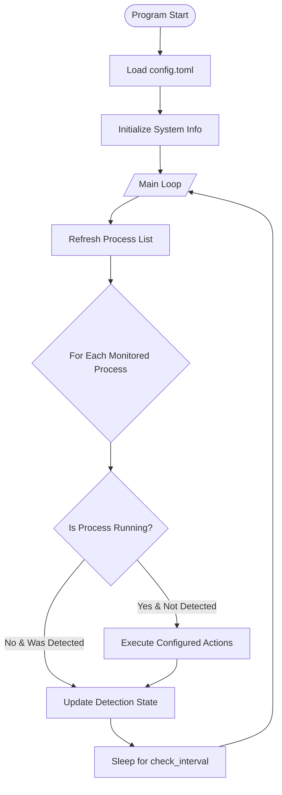

# Proc Monitor

A Windows process monitoring utility written in Rust that automatically executes actions (close/start programs) when specified processes are detected.

## Features

- **Process Monitoring**: Monitor specified processes and trigger actions when they start/stop
- **Flexible Actions**: Configure to close or start programs when monitored processes are detected
- **Background Mode**: Run silently in the background with file logging
- **TOML Configuration**: Simple, human-readable configuration file
- **Multi-process Support**: Monitor multiple processes with different action sets

## Use Case

Automatically close resource-intensive background applications when launching games:

> When launching a game (e.g., Steam), automatically close VPN proxies or other applications to avoid conflicts or improve performance.

## Installation

### Build from Source

```bash
git clone https://github.com/yourusername/proc_monitor.git
cd proc_monitor
cargo build --release
```

The executable will be at `target/release/proc_monitor.exe`.

### Directory Structure

After building, ensure the following structure:

```
proc_monitor.exe
configure/
  config.toml
```

## Usage

### Command Line Arguments

| Argument | Description |
|----------|-------------|
| (no args) | Run in foreground with console output |
| `-b`, `--background` | Run in background mode (no console window) |
| `-l`, `--log_file` | Enable file logging to `proc_monitor.log` |
| `-h`, `--help` | Show help message |

### Examples

```bash
# Run in foreground (console output)
proc_monitor.exe

# Run in background mode
proc_monitor.exe -b

# Run with file logging
proc_monitor.exe -l
```

## Configuration

Edit `configure/config.toml` to customize monitoring behavior:

```toml
[log]
level = "info"
file_path = "logs/proc_monitor.log"
console = true
max_size_mb = 10
max_files = 5

daemon = false
pid_file = "proc_monitor.pid"

[[monitor.process]]
monitored = "steam.exe"
action = { "clash-verge.exe" = "close", "ShadowsocksR.exe" = "close" }
check_interval = 10

[[monitor.process]]
monitored = "EpicGamesLauncher.exe"
action = { "clash-verge.exe" = "close", "ShadowsocksR.exe" = "close" }
check_interval = 10
```

### Configuration Fields

| Field | Description |
|-------|-------------|
| `monitored` | Process name to monitor (e.g., `steam.exe`) |
| `action` | Map of process names to actions (`close` or `start`) |
| `check_interval` | How often to check for the process (seconds) |

### Action Types

| Action | Description |
|--------|-------------|
| `close` | Terminate the specified process |
| `start` | Launch the specified process |

## How It Works



## Architecture

The project follows a modular architecture:

| Module | Responsibility |
|--------|---------------|
| `config` | Configuration loading and parsing |
| `logger` | Logging to console or file |
| `process` | Process detection and termination |
| `cli` | Command-line argument parsing |

For detailed architecture documentation, see [docs/Architecture.md](docs/Architecture.md) and [docs/Modules.md](docs/Modules.md).

## Dependencies

- [sysinfo](https://crates.io/crates/sysinfo) - System information and process management
- [serde](https://crates.io/crates/serde) - Serialization framework
- [toml](https://crates.io/crates/toml) - TOML parsing
- [chrono](https://crates.io/crates/chrono) - Date and time handling
- [winapi](https://crates.io/crates/winapi) - Windows API bindings

## Platform Support

Currently supports **Windows only** due to:
- Windows-specific `taskkill` command for process termination
- Windows-specific background process creation (`CREATE_NO_WINDOW` flag)
