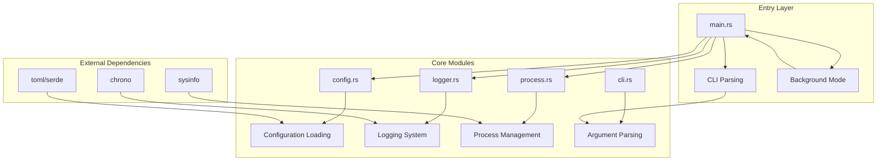
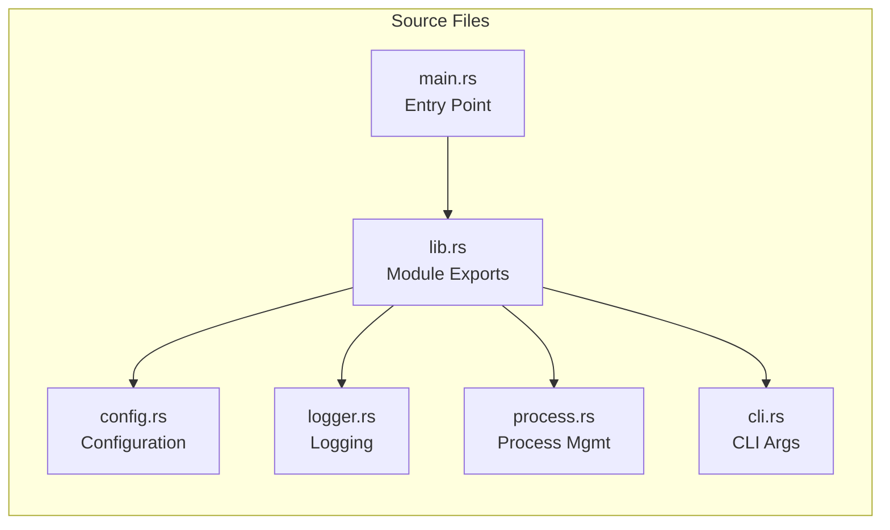
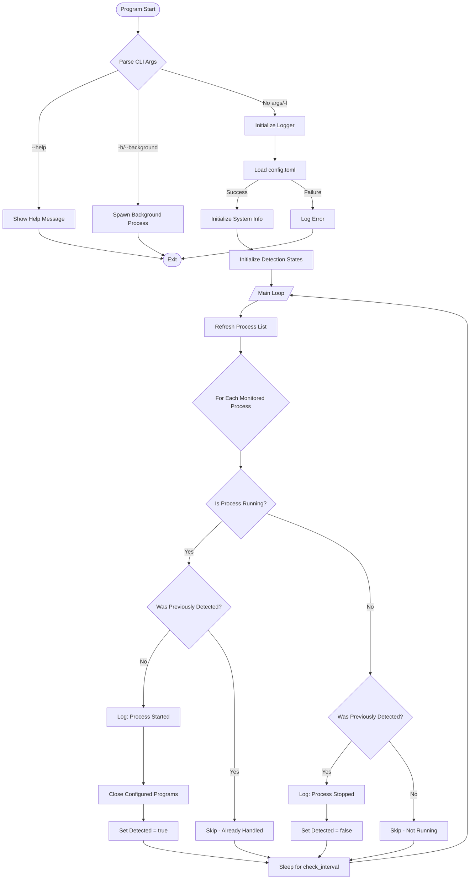
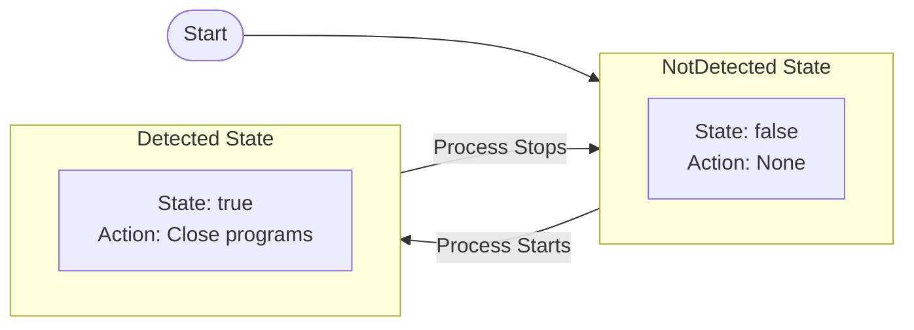
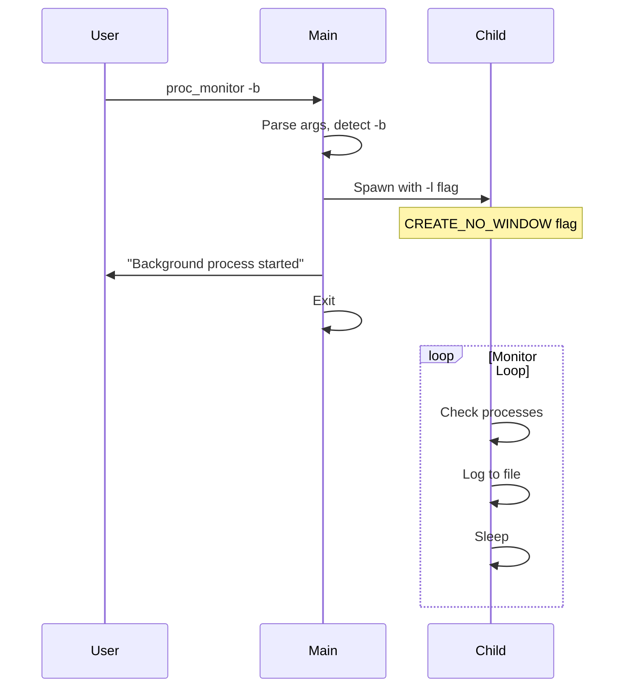
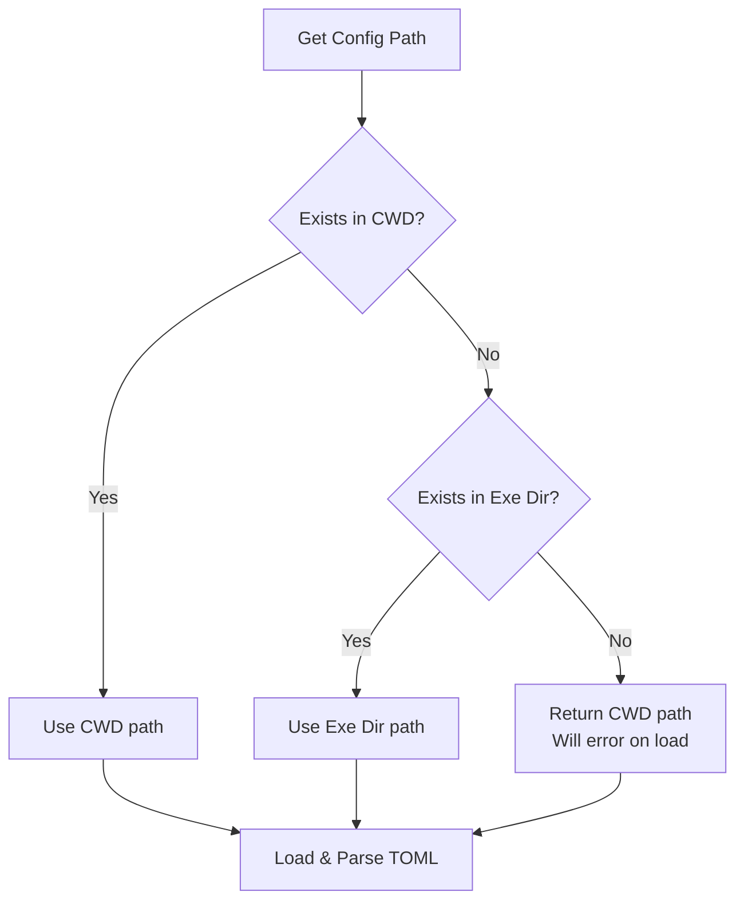

# Architecture

## Overview

**Proc Monitor** is a Windows process monitoring utility that automatically closes specified programs when certain processes are detected running.

### Use Case

When launching a game (e.g., Steam), automatically close certain background applications (e.g., VPN proxies) to avoid conflicts or improve performance.

## System Architecture

## Module Structure

## Process Flow

## State Machine

## Background Mode Implementation

## Configuration Loading Strategy

## Key Design Decisions

| Decision | Rationale |
|----------|-----------|
| Module separation | Single responsibility, testability |
| State machine for detection | Edge-triggered logic prevents repeated actions |
| taskkill over native API | Simplicity, reliability, force close support |
| Dual logging mode | Flexibility for foreground/background operation |
| TOML configuration | Human-readable, easy to edit |
