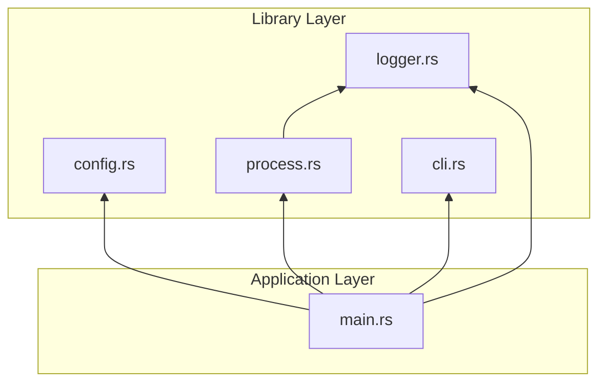
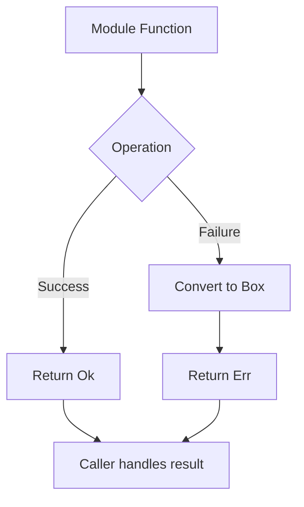

# Modules

## Module Overview

| Module | Responsibility | Key Types |
|--------|---------------|-----------|
| `config` | Configuration loading and parsing | `ProcessMonitored`, `MonitorConfig`, `ProcessConfig` |
| `logger` | Logging to console or file | `Logger`, `LogLevel` |
| `process` | Process detection and termination | - |
| `cli` | Command-line argument parsing | `CliArgs` |

## Module Dependencies



## config Module

**File**: [config.rs](../src/config.rs)

### Responsibility
Load and parse TOML configuration files.

### Public API

```rust
pub struct ProcessMonitored {
    pub monitor: MonitorConfig,
}

pub struct MonitorConfig {
    pub process: Vec<ProcessConfig>,
}

pub struct ProcessConfig {
    pub monitored: String,
    pub to_close: Vec<String>,
    pub check_interval: u64,
}

pub fn get_config_path() -> PathBuf;
pub fn load_config() -> Result<ProcessMonitored, Box<dyn std::error::Error>>;
```

### Configuration Search Strategy
1. `<current_working_directory>/configure/config.toml`
2. `<executable_directory>/configure/config.toml`

---

## logger Module

**File**: [logger.rs](../src/logger.rs)

### Responsibility
Provide unified logging interface for console and file output.

### Public API

```rust
pub enum LogLevel {
    Info,
    Warning,
    Error,
}

pub struct Logger {
    // private fields
}

impl Logger {
    pub fn new(to_log: bool) -> Result<Self, Box<dyn std::error::Error>>;
    pub fn log(&mut self, level: LogLevel, message: &str);
    pub fn info(&mut self, message: &str);
    pub fn warning(&mut self, message: &str);
    pub fn error(&mut self, message: &str);
}
```

### Output Modes
- **Console mode** (`to_log = false`): Print to stdout/stderr
- **File mode** (`to_log = true`): Append to `proc_monitor.log` in executable directory

### Log Format
```
[YYYY-MM-DD HH:MM:SS] [LEVEL] message
```

---

## process Module

**File**: [process.rs](../src/process.rs)

### Responsibility
Detect and terminate processes.

### Public API

```rust
pub fn is_process_running(sys: &System, process_name: &str) -> bool;

pub fn close_process(
    sys: &System,
    process_name: &str,
    logger: &mut Logger,
) -> Result<(), Box<dyn std::error::Error>>;

pub fn close_processes(sys: &System, process_names: &[String], logger: &mut Logger);
```

### Implementation Notes
- Uses `sysinfo` crate for process enumeration
- Uses Windows `taskkill` command for termination
- `/F` flag forces termination of hung processes
- `/IM` allows closing by image name

---

## cli Module

**File**: [cli.rs](../src/cli.rs)

### Responsibility
Parse command-line arguments.

### Public API

```rust
pub struct CliArgs {
    pub log_to_file: bool,
    pub is_background: bool,
    pub show_help: bool,
}

pub fn parse_args() -> CliArgs;
pub fn print_help();
```

### Supported Arguments

| Argument | Description |
|----------|-------------|
| `-b`, `--background` | Run in background mode (no console) |
| `-l`, `--log_file` | Enable file logging |
| `-h`, `--help` | Show help message |

---

## Error Handling Strategy

All modules use `Result<T, Box<dyn std::error::Error>>` for flexible error propagation:



## Thread Safety

- `Logger` uses `&mut self` for writes, requiring external synchronization if shared
- `System` from `sysinfo` is not thread-safe; use separate instances per thread
- Configuration is loaded once at startup and is read-only thereafter
