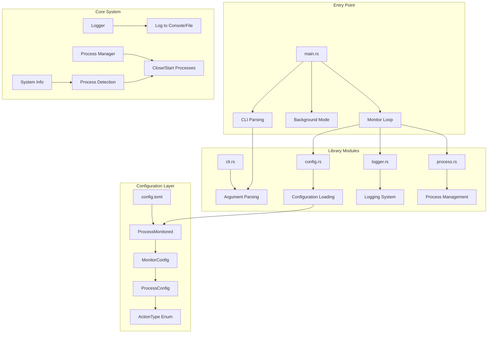
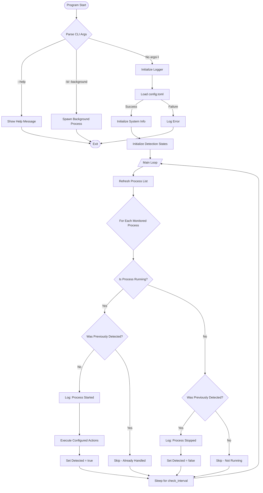
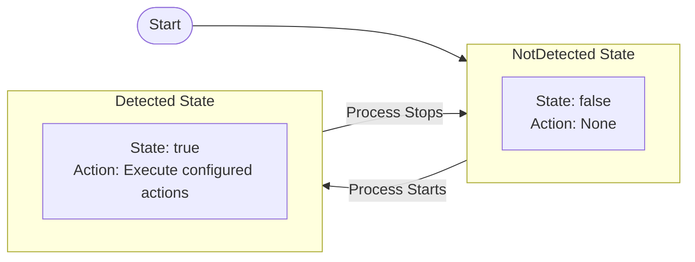
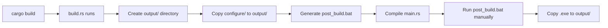

# Proc Monitor - Process Monitor Project Explanation

## 1. Project Overview

**Proc Monitor** is a Windows process monitoring utility that automatically performs actions (close or start programs) when certain processes are detected running.

### Use Case Example

When you launch a game (like Steam or Epic Games Launcher), you might want to automatically close certain background applications (like VPN proxies) to avoid conflicts or improve performance. This tool handles that automatically. You can also configure it to start programs when a monitored process is detected.

***

## 2. Overall Architecture

The project follows a **modular architecture** with clear separation of concerns:



### Module Responsibilities

| Module | Responsibility |
|--------|----------------|
| [main.rs](file:///d:/work/_sync/self/learning/rust_study/proc_monitor/src/main.rs) | Entry point, orchestrates the monitoring loop |
| [lib.rs](file:///d:/work/_sync/self/learning/rust_study/proc_monitor/src/lib.rs) | Public API exports |
| [cli.rs](file:///d:/work/_sync/self/learning/rust_study/proc_monitor/src/cli.rs) | Command-line argument parsing |
| [config.rs](file:///d:/work/_sync/self/learning/rust_study/proc_monitor/src/config.rs) | Configuration structures and loading |
| [logger.rs](file:///d:/work/_sync/self/learning/rust_study/proc_monitor/src/logger.rs) | Logging to console or file |
| [process.rs](file:///d:/work/_sync/self/learning/rust_study/proc_monitor/src/process.rs) | Process detection and management |

***

## 3. Main Process Flow



***

## 4. Core Code Explanation

### 4.1 Project Structure

The project uses a **library crate pattern** where the main logic is organized into reusable modules:

```
proc_monitor/
├── src/
│   ├── main.rs      # Entry point
│   ├── lib.rs       # Public API exports
│   ├── cli.rs       # CLI argument handling
│   ├── config.rs    # Configuration management
│   ├── logger.rs    # Logging system
│   └── process.rs   # Process operations
├── configure/
│   └── config.toml  # Configuration file
├── build.rs         # Build script
└── Cargo.toml       # Project manifest
```

**Why This Structure?**

1. **Separation of Concerns**: Each module has a single responsibility
2. **Testability**: Individual modules can be tested in isolation
3. **Maintainability**: Changes to one module don't affect others
4. **Reusability**: The library can be used by other projects

***

### 4.2 Configuration Structures

```rust
#[derive(Debug, Clone, PartialEq, Eq)]
pub enum ActionType {
    Close,
    Start,
}

#[derive(Debug, Deserialize)]
pub struct ProcessMonitored {
    pub monitor: MonitorConfig,
}

#[derive(Debug, Deserialize)]
pub struct MonitorConfig {
    pub process: Vec<ProcessConfig>,
}

#[derive(Debug, Deserialize, Clone)]
pub struct ProcessConfig {
    pub monitored: String,              // Process name to watch (e.g., "steam.exe")
    pub action: HashMap<String, ActionType>,  // Actions: close or start programs
    pub check_interval: u64,            // Check interval in seconds
}
```

**Key Design Points:**

1. **ActionType Enum**: Represents the two possible actions
   - `Close`: Terminate a process
   - `Start`: Launch a process
   
2. **HashMap for Actions**: Instead of a simple list, we use `HashMap<String, ActionType>`
   - Key: Process name (e.g., "clash-verge.exe")
   - Value: Action to perform (Close or Start)
   - Allows flexible configuration per monitored process

3. **Custom Deserialization**: ActionType implements custom `Deserialize`
   ```rust
   impl<'de> Deserialize<'de> for ActionType {
       fn deserialize<D>(deserializer: D) -> Result<Self, D::Error>
       where
           D: Deserializer<'de>,
       {
           let s = String::deserialize(deserializer)?;
           match s.to_lowercase().as_str() {
               "close" => Ok(ActionType::Close),
               "start" => Ok(ActionType::Start),
               _ => Err(serde::de::Error::custom(format!(
                   "Unknown action type: {}, expected 'close' or 'start'",
                   s
               ))),
           }
       }
   }
   ```
   This allows case-insensitive parsing of action types from TOML.

***

### 4.3 CLI Argument Parsing

```rust
pub struct CliArgs {
    pub log_to_file: bool,
    pub is_background: bool,
    pub show_help: bool,
}

impl Default for CliArgs {
    fn default() -> Self {
        Self {
            log_to_file: false,
            is_background: false,
            show_help: false,
        }
    }
}

pub fn parse_args() -> CliArgs {
    let args: Vec<String> = env::args().collect();
    let mut cli_args = CliArgs::default();

    for arg in &args[1..] {
        match arg.as_str() {
            "-b" | "--background" => {
                cli_args.is_background = true;
                cli_args.log_to_file = true;
            }
            "-l" | "--log_file" => cli_args.log_to_file = true,
            "-h" | "--help" => cli_args.show_help = true,
            _ => {
                eprintln!("Unknown argument: {}", arg);
                eprintln!("Use --help for usage information");
                std::process::exit(1);
            }
        }
    }

    cli_args
}
```

**Design Patterns Used:**

1. **Default Trait**: Provides sensible default values
2. **Builder-like Pattern**: Arguments modify the struct incrementally
3. **Fail-Fast**: Unknown arguments cause immediate exit with error

***

### 4.4 Logger Implementation

```rust
pub enum LogLevel {
    Info,
    Warning,
    Error,
}

pub struct Logger {
    log_file: Option<File>,
    to_logging: bool,
}

impl Logger {
    pub fn new(to_log: bool) -> Result<Self, Box<dyn std::error::Error>> {
        let log_file = if to_log {
            if let Ok(exe_path) = env::current_exe() {
                if let Some(exe_dir) = exe_path.parent() {
                    let log_path = exe_dir.join("proc_monitor.log");
                    let file = OpenOptions::new()
                        .create(true)
                        .append(true)
                        .open(log_path)?;
                    Some(file)
                } else {
                    None
                }
            } else {
                None
            }
        } else {
            None
        };

        Ok(Logger {
            log_file,
            to_logging: to_log,
        })
    }

    pub fn log(&mut self, level: LogLevel, message: &str) {
        let timestamp = Local::now().format("%Y-%m-%d %H:%M:%S");
        let level_str = match level {
            LogLevel::Info => "INFO",
            LogLevel::Warning => "WARNING",
            LogLevel::Error => "ERROR",
        };
        let log_message = format!("[{}] [{}] {}\n", timestamp, level_str, message);

        if self.to_logging {
            if let Some(file) = &mut self.log_file {
                if let Err(e) = file.write_all(log_message.as_bytes()) {
                    eprintln!("Failed to write to log file: {}", e);
                }
                let _ = file.flush();
            }
        } else {
            match level {
                LogLevel::Info => println!("{}", &log_message[..log_message.len() - 1]),
                LogLevel::Warning => println!("{}", &log_message[..log_message.len() - 1]),
                LogLevel::Error => eprintln!("{}", &log_message[..log_message.len() - 1]),
            }
        }
    }

    pub fn info(&mut self, message: &str) {
        self.log(LogLevel::Info, message);
    }

    pub fn warning(&mut self, message: &str) {
        self.log(LogLevel::Warning, message);
    }

    pub fn error(&mut self, message: &str) {
        self.log(LogLevel::Error, message);
    }
}
```

**Key Design Points:**

1. **Dual Output Mode**
   - `to_logging = false`: Output to console (foreground mode)
   - `to_logging = true`: Output to file (background mode)

2. **Log File Location**
   - Placed in the same directory as the executable
   - Uses `append` mode to preserve history across runs

3. **Convenience Methods**: `info()`, `warning()`, `error()` wrapper methods

4. **Error Resilience**: Log file write errors don't crash the program

***

### 4.5 Process Detection Logic

```rust
use std::ffi::OsStr;

pub fn is_process_running(sys: &System, process_name: &str) -> bool {
    sys.processes_by_name(OsStr::new(process_name))
        .next()
        .is_some()
}
```

**Explanation:**

- Uses `sysinfo` crate's `System` struct to query running processes
- `processes_by_name()` returns an iterator of matching processes
- `OsStr::new()` converts Rust string to OS-compatible string
- `.next().is_some()` checks if at least one match exists
- This is efficient because it doesn't collect all matches into a vector

**API Update Note:**

The `sysinfo` crate API has evolved:
- **Old API**: `sys.refresh_processes()`
- **New API**: `sys.refresh_processes(ProcessesToUpdate::All, true)`

The new API is more explicit about what to refresh.

***

### 4.6 Process Management

#### Closing Processes

```rust
pub fn close_process(
    sys: &System,
    process_name: &str,
    logger: &mut Logger,
) -> Result<(), Box<dyn std::error::Error>> {
    logger.info(&format!("Attempting to close program: {}", process_name));

    if !sys
        .processes_by_name(OsStr::new(process_name))
        .next()
        .is_some()
    {
        logger.info(&format!(
            "Program {} is not running, skipping.",
            process_name
        ));
        return Ok(());
    }

    let output = Command::new("taskkill")
        .args(["/F", "/IM", process_name])
        .output()?;

    if output.status.success() {
        logger.info(&format!("Successfully closed program: {}", process_name));
        Ok(())
    } else {
        let error_message = String::from_utf8_lossy(&output.stderr);
        Err(format!("Failed to close program: {}", error_message).into())
    }
}
```

**Why Use `taskkill` Instead of Rust's Process API?**

1. **Simplicity**: `taskkill` is a well-tested Windows utility
2. **Force Close**: `/F` flag forces termination of hung processes
3. **By Name**: `/IM` allows closing by image name (process name)
4. **Error Handling**: Windows provides clear error messages

#### Starting Processes

```rust
pub fn start_process(
    process_name: &str,
    logger: &mut Logger,
) -> Result<(), Box<dyn std::error::Error>> {
    logger.info(&format!("Attempting to start program: {}", process_name));

    let output = Command::new("cmd")
        .args(["/C", "start", "", process_name])
        .spawn();

    match output {
        Ok(_) => {
            logger.info(&format!("Successfully started program: {}", process_name));
            Ok(())
        }
        Err(e) => Err(format!("Failed to start program {}: {}", process_name, e).into()),
    }
}
```

**How It Works:**

- Uses Windows `cmd /C start` command to launch programs
- The empty string `""` after `start` is the window title (required by `start` command)
- `.spawn()` starts the process without waiting for it to complete

#### Executing Actions

```rust
pub fn execute_actions(
    sys: &System,
    actions: &HashMap<String, ActionType>,
    logger: &mut Logger,
) {
    for (process_name, action_type) in actions {
        match action_type {
            ActionType::Close => {
                match close_process(sys, process_name, logger) {
                    Ok(_) => (),
                    Err(e) => logger.error(&format!("Error closing program {}: {}", process_name, e)),
                }
            }
            ActionType::Start => {
                match start_process(process_name, logger) {
                    Ok(_) => (),
                    Err(e) => logger.error(&format!("Error starting program {}: {}", process_name, e)),
                }
            }
        }
    }
}
```

**Design Pattern:**

- **Strategy Pattern**: ActionType determines which strategy to execute
- **Error Isolation**: Errors in one action don't prevent other actions from executing
- **Logging**: All actions are logged for debugging

***

### 4.7 State Machine for Detection

```rust
fn run_monitor(cli_args: CliArgs) -> Result<(), Box<dyn std::error::Error>> {
    let mut logger = Logger::new(cli_args.log_to_file)?;
    let config = load_config()?;
    
    let mut sys = System::new_all();
    let mut process_detections = vec![false; config.monitor.process.len()];

    let check_interval = config
        .monitor
        .process
        .iter()
        .map(|p| p.check_interval)
        .min()
        .unwrap_or(10);

    loop {
        sys.refresh_processes(ProcessesToUpdate::All, true);

        for (index, process_config) in config.monitor.process.iter().enumerate() {
            let is_running = is_process_running(&sys, &process_config.monitored);
            let detected = &mut process_detections[index];

            if is_running && !*detected {
                // Transition: Not Detected -> Detected
                logger.info(&format!(
                    "Detected process {} has started",
                    process_config.monitored
                ));
                execute_actions(&sys, &process_config.action, &mut logger);
                *detected = true;
            } else if !is_running && *detected {
                // Transition: Detected -> Not Detected
                logger.info(&format!(
                    "Process {} has stopped running",
                    process_config.monitored
                ));
                *detected = false;
            }
        }

        std::thread::sleep(Duration::from_secs(check_interval));
    }
}
```

**State Transition Diagram:**



**State Behavior:**

- **NotDetected**: Process is not running. No action taken.
- **Detected**: Process is running. Execute configured actions (only once on transition).

**Why This Design?**

1. **Edge-Triggered Logic**: Actions only occur on state transitions, not continuously
2. **Prevents Repeated Actions**: If Steam is running for hours, we don't repeatedly execute actions
3. **Efficient**: Only one boolean per monitored process

***

### 4.8 Background Mode Implementation

```rust
fn run_in_background() -> Result<(), Box<dyn std::error::Error>> {
    let exe_path = env::current_exe()?;
    let args: Vec<String> = vec![exe_path.to_string_lossy().to_string(), "-l".to_string()];

    #[cfg(target_os = "windows")]
    {
        use std::os::windows::process::CommandExt;

        const CREATE_NO_WINDOW: u32 = 0x08000000;

        std::process::Command::new(&args[0])
            .args(&args[1..])
            .creation_flags(CREATE_NO_WINDOW)
            .spawn()?;
    }

    #[cfg(not(target_os = "windows"))]
    {
        std::process::Command::new(&args[0])
            .args(&args[1..])
            .spawn()?;
    }

    Ok(())
}
```

**How It Works:**

1. **User runs**: `proc_monitor -b`
2. **Main process**: Spawns a child process with `-l` flag, then exits
3. **Child process**: Runs with `CREATE_NO_WINDOW` flag (no console window)
4. **Result**: Silent background process with file logging

**Windows-Specific Flag:**

- `CREATE_NO_WINDOW (0x08000000)`: Prevents creating a console window
- Only available on Windows via `CommandExt` trait

**Cross-Platform Consideration:**

The `#[cfg(target_os = "windows")]` attribute ensures the code compiles on non-Windows platforms, though the primary use case is Windows.

***

### 4.9 Configuration File Loading

```rust
pub fn get_config_path() -> PathBuf {
    let mut config_path = env::current_dir().unwrap_or_else(|_| PathBuf::from("."));
    config_path.push("configure");
    config_path.push("config.toml");

    if !config_path.exists() {
        if let Ok(exe_path) = env::current_exe() {
            if let Some(exe_dir) = exe_path.parent() {
                let mut exe_config_path = PathBuf::from(exe_dir);
                exe_config_path.push("configure");
                exe_config_path.push("config.toml");
                if exe_config_path.exists() {
                    return exe_config_path;
                }
            }
        }
    }

    config_path
}

pub fn load_config() -> Result<ProcessMonitored, Box<dyn std::error::Error>> {
    let config_path = get_config_path();
    let mut file = File::open(&config_path)?;
    let mut contents = String::new();
    file.read_to_string(&mut contents)?;

    let config: ProcessMonitored = toml::from_str(&contents)?;
    Ok(config)
}
```

**Search Strategy:**

1. First: `<current_working_directory>/configure/config.toml`
2. Fallback: `<executable_directory>/configure/config.toml`

This allows the program to work both during development and when deployed.

***

## 5. Build System (build.rs)

```rust
fn main() {
    let manifest_dir = std::env::var("CARGO_MANIFEST_DIR").expect("...");
    let project_root = Path::new(&manifest_dir);
    
    let target_dir = project_root.join("target");
    let output_dir = target_dir.join("output");
    fs::create_dir_all(&output_dir)?;
    
    // Copy configure directory
    let source_config_dir = project_root.join("configure");
    let target_config_dir = output_dir.join("configure");
    
    if source_config_dir.exists() {
        Command::new("cmd.exe")
            .args(["/C", "xcopy", 
                   source_config_dir.to_str().unwrap(),
                   target_config_dir.to_str().unwrap(),
                   "/E", "/I", "/Y"])
            .output();
    }
    
    // Create post_build.bat for manual deployment
    // ... (creates batch script to copy exe to output folder)
}
```

**Build Process Flow:**



**Why Use build.rs?**

1. **Automation**: Automatically copies configuration files during build
2. **Deployment Ready**: Creates an output directory with all necessary files
3. **Post-Batch Script**: Generates a batch file for manual deployment

***

## 6. Configuration File Format

```toml
# config.toml

[[monitor.process]]
monitored = "steam.exe"
action = { "clash-verge.exe" = "close", "ShadowsocksR.exe" = "close" }
check_interval = 10

[[monitor.process]]
monitored = "EpicGamesLauncher.exe"
action = { "clash-verge.exe" = "close", "ShadowsocksR.exe" = "close" }
check_interval = 10

# Example with both close and start actions:
[[monitor.process]]
monitored = "game.exe"
action = { "discord.exe" = "close", "overlay.exe" = "start" }
check_interval = 5
```

**TOML Structure Explained:**

- `[[monitor.process]]` creates an array element
- Multiple `[[monitor.process]]` blocks = multiple monitoring rules
- Each rule is independent with its own interval
- `action` is a HashMap where:
  - Key: Process name
  - Value: "close" or "start" (case-insensitive)

**Action Types:**

| Action | Description |
|--------|-------------|
| `close` | Terminates the specified process |
| `start` | Launches the specified process |

***

## 7. Key Dependencies

| Crate | Purpose | Version |
|-------|---------|---------|
| `sysinfo` | Cross-platform system/process information | 0.38.4 |
| `toml` | Parse TOML configuration files | 1.1.2 |
| `serde` | Serialization/deserialization framework | 1.0 |
| `serde_json` | JSON support (for future extensions) | 1.0.149 |
| `chrono` | Date/time formatting for logs | 0.4 |
| `winapi` | Windows API bindings (console control) | 0.3.9 |

**Dependency Features:**

```toml
[dependencies]
sysinfo = "0.38.4"
toml = "1.1.2"
serde = { version = "1.0", features = ["derive"] }
serde_json = "1.0.149"
chrono = { version = "0.4", default-features = false, features = ["clock", "std"] }
winapi = { version = "0.3.9", features = ["wincon"] }
```

- `serde` with `derive` feature: Enables derive macros for serialization
- `chrono` with minimal features: Reduces binary size by excluding unnecessary features
- `winapi` with `wincon` feature: Windows console control functions

***

## 8. Usage

```powershell
# Run in foreground (console output)
proc_monitor.exe

# Run in background (no console, logs to file)
proc_monitor.exe -b

# Run with file logging (foreground with log file)
proc_monitor.exe -l

# Show help
proc_monitor.exe -h
```

**Command-Line Arguments:**

| Argument | Short | Description |
|----------|-------|-------------|
| `--background` | `-b` | Run in background mode (no console window) |
| `--log_file` | `-l` | Enable file logging |
| `--help` | `-h` | Show help message |

***

## 9. Public API (lib.rs)

```rust
pub mod cli;
pub mod config;
pub mod logger;
pub mod process;

pub use cli::{parse_args, print_help, CliArgs};
pub use config::{
    get_config_path, load_config, ActionType, MonitorConfig, ProcessConfig, ProcessMonitored,
};
pub use logger::{LogLevel, Logger};
pub use process::{close_process, close_processes, execute_actions, is_process_running, start_process};
```

**API Design:**

- **Re-exports**: All public items are re-exported from `lib.rs`
- **Namespace Organization**: Modules group related functionality
- **Clean Interface**: Users only need to import `proc_monitor::*`

***

## 10. Summary

This project demonstrates several important Rust concepts:

### Architecture Patterns

1. **Modular Design**: Clear separation of concerns across modules
2. **Library Crate Pattern**: Reusable components with public API
3. **Strategy Pattern**: ActionType determines execution strategy

### Rust Language Features

1. **Error Handling**: Uses `Result<T, Box<dyn std::error::Error>>` for flexible error propagation
2. **Trait Objects**: `Box<dyn std::error::Error>` for dynamic error types
3. **Platform-Specific Code**: `#[cfg(target_os = "windows")]` for conditional compilation
4. **State Machine Pattern**: Boolean flags for edge-triggered detection
5. **Builder Pattern**: `OpenOptions` for file configuration
6. **Default Trait**: Provides sensible default values for structs
7. **Custom Deserialization**: Implementing `Deserialize` for custom parsing logic

### System Programming

1. **External Process Control**: `std::process::Command` for spawning and controlling processes
2. **Configuration Management**: TOML parsing with serde
3. **Logging Abstraction**: Single interface for multiple output destinations
4. **Build Scripts**: Automating deployment with `build.rs`

### Best Practices

1. **Error Resilience**: Errors don't crash the program
2. **Logging**: All operations are logged for debugging
3. **Configuration Flexibility**: Supports multiple monitoring rules with different intervals
4. **Cross-Platform Considerations**: Conditional compilation for platform-specific code

***

## 11. Future Enhancements

Potential improvements for the project:

1. **Configuration Hot Reload**: Reload config without restarting
2. **Process Whitelist/Blacklist**: More sophisticated matching rules
3. **Web Interface**: Monitor and configure via web UI
4. **System Tray Icon**: Visual indicator when running
5. **Multiple Action Types**: Support for scripts, delays, conditional actions
6. **Process Groups**: Group processes for coordinated actions
7. **Health Checks**: Monitor process health, not just existence
